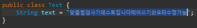
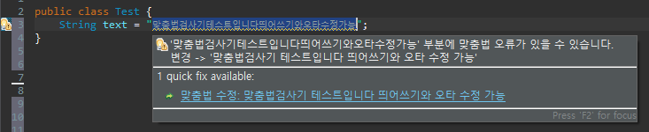

# Korean Spell Checker 1.0 (eclipse plugin)
이클립스에서만 동작하는 맞춤법 검사기이며,  
내부에서 작동하는 API는 파이썬으로 구현된 API입니다.
(API 출처: https://github.com/ssut/py-hanspell)

업무 중에 맞춤법 검사를 할 일이 많았는데  
매번 다른 플랫폼의 맞춤법 검사기를 사용하기 귀찮아서 만들었습니다.  

누구든 사용하셔도 되고 
네이버 맞춤법 검사기를 사용하기에  
네이버 맞춤법 검사기의 성능을 따릅니다.

## Required Libraries

- java (필수)
- eclipse (필수)
- python 3.xx (필수)
- python setupTools (라이브러리 사용 시 설치여부 물어봄)
- python requests (라이브러리 사용 시 설치여부 물어봄)

## version
해당 플러그인 프로젝트는 jdk 1.8로 빌드되었고,  
jdk 21이상부터는 에러가 발생할 수 있습니다. 
최신 이클립스 버전들은 jdk 21을 권장하기에 
에러 발생 시 issue 탭에 남겨주시면 감사하겠습니다.

## How to use

jar 폴더 안의 korean-spellcheck_1.0.0.202504221707.jar 파일을  
이클립스 설치 경로의 plugins 폴더에 복사 후 이클립스 재실행.   

 
맞춤법 검사를 원하는 문장에 드래그 후 Alt + Shift + 1
   
 
맞춤법이 틀려 결과가 있는 경우 warning marker가 생성됩니다. 
변경을 원할 경우 quick fix 클릭
  

*참고 
Korean Spell Checker 1.0 에서  
JSP 파일과 THYMELEAF 파일은 quick fix 기능이 동작하지 않습니다.

## License

MIT
